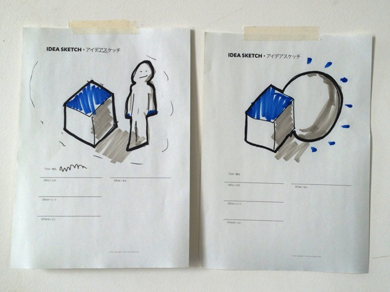

# メイカソン参加同意書に関するFAQ

**本FAQは、「メイカソン参加同意書」により運営されるイベントに関するものであり、異なるルールにより運営されるメイカソンに関する説明ではありません。また、そのような異なるルールにより運営されるメイカソンを否定する趣旨でもありません。**

---

Q：同意書の第3項【アイデア】に関して、アイデアによっては特許等として権利化できる場合があると思います。それをどうして人類の共有財産（パブリックドメイン）として扱ってしまうのでしょうか。

A：よく誤解されていることですが、アイデアは著作物にあたらず著作権により保護されませんし、アイデアそのものに特許権等の知的財産権が発生するわけではありません。アイデアについては、特許権、実用新案権、意匠権などに関し特許庁に出願を申請し、登録されることで初めて権利が発生します。また、そうした申請を行うためには、アイデアをどのように実現すればよいかという技術的な実現方法を伴う必要があり、そのような実現方法を伴って初めてアイデアは特許権の対象となる発明となります。

本同意書では、実現方法を伴った発明として権利化される場合を除外したうえで、メイカソンでプロトタイプとして実装したものに関しては、このような実現方法を伴い、権利化される可能性がある「成果物」として、アイデアと区別して規定しています。本同意書第3項は、このようなアイデアに関する法律上の地位を確認した規定ということになります。

なお、アイデア自体についても、法律上まったく保護されないわけではなく、デッドコピーの場合には不正競争防止法や民法による保護が受けられる場合があります。また、アイデアを第三者に利用されることを望まないのであれば、NDA（秘密保持契約）を締結したり、そもそもメイカソンにそのようなアイデアを持ち込むことを控えたりする等の方策も考えられます。

---

Q：メイカソンでそのまま製品にできそうなプロトタイプまでできた場合、製品化に向けて進めたいという希望が出てくると思います。その場合、メイカソンでチームメンバーだった人々との間における権利の取り扱いは、どのように考えれば良いでしょうか。

A：チームのメンバーがそれぞれどのようにメイカソンでの成果物に貢献または寄与したかはケースバイケースですし、それぞれの貢献等は権利として明確に切り分けることが不可能なこともあります。また、多くの場合にはメンバー全員がその後の製品化に参加することはなく、一部のメンバーのみ参加することや、製品化に適したメンバーに入れ替えること等、プロジェクトの仕切り直しがあると思います。メイカソンの終了後に製品化に向けて進めたいと考える場合には、後で権利を巡って争いにならないよう、チームのメンバーしっかり話し合い、契約書を交わすなど、権利関係を明確化して、後にトラブルにならないようにしておくことが望まれます。ここでは、ご参考までに、以下の2つの考え方を示します。

* メイカソンの発表までの成果物に関し、同チームのメンバーは、氏名を表示する代わりに営利、非営利に関わらず無償で自由に利用できる権利を有する。

* メイカソンの発表までの成果物に関し、その成果物に基づき製品が発売され、利益が発生した場合には、一定の割合（例：純利益の3%）をチームメンバーに支払う。

いずれにしても、製品として世の中に発売するためには、開発・製造過程の途中で技術的あるいは組織的な問題で失敗する、他人の持つ知的財産権を侵害して訴えられる、販売までたどり着いても商業的に失敗するなど、様々なリスクが伴います。確かに、アイデアを創出し、それをプロトタイプとして実装までの段階も非常に重要ですが、その後のプロセスの大変さをお互いに十分理解して、上記のような取り決めをしておくことが重要です。

---

Q：このメイカソンには多様な人々が様々な動機で参加すると思います。私自身は、良いアイデアができたらぜひビジネスにしたいと考えています。メイカソンの期間終了後、他のチームメンバーが継続を希望しない場合でも、その後のブラッシュアップを勝手に一人でやってよいでしょうか。その場合、元々のアイデアとは大きく変化していくこともあると思いますが、最初のアイデアをつくるに参加した人々のクレジット等はどこまですべきでしょうか。

A：法的には、アイデア自体には原則として権利が発生しないため、メイカソンにおいて出てきたアイデアを独自にビジネス化することも可能なように思います。しかし、一方で、メイカソンのアイデアをビジネス化する場合、そのアイデアと思われるものに著作物が混入していたり、アイデアと著作物の区別が曖昧なものがあったりすることが多いのが現実です。また、実装を進めていく段階で大きく変化し、実現方法やビジネスモデルが異なるものになったのに、同じアイデアに見えてしまうこともあります。後のトラブル防止の観点からも、メイカソン終了時、他のメンバーと、製品化に継続して参加を希望するか否か、独自に製品化をしてよいか、製品化の際にクレジットを入れるか否か等について話し合っておくことを推奨いたします。

---

Q：メイカソンの他の参加者が創出したアイデアとほぼ同じものを、現在あるクライアントとのプロジェクトで進めています。こちらが先に発表した場合、その参加者のアイデアを盗んだという誤解を受けないよう、既に取り組んでいることを伝えたいと思います。そのクライアントとのNDA（秘密保持契約）に違反することなく、同じアイデアを既に持っていることを伝えるにはどうすればいいでしょうか。

A：行き馬の目を抜くような技術の世界において、偶然にも、同様の技術を開発しているということは日常茶飯事です。本件のような場合には、NDAに反しないかぎりで、イベント限りで同様のプロジェクトを先に進めていたことを伝えることが考えられますが、イベントにおいてプロトタイプしたばかりの人に、そのようなことを伝えても、あまり実効性がない場合も考えられるところです。

もちろん、イベント時にそのようなことを伝えておくことも重要ですが、より肝心なのは、先に開発している者は、後にトラブルになった場合にも先に開発したことが客観的にもわかるような資料をしっかりと残しておくことでしょう。なお、法的には、日本の特許制度は先願主義を採用していますので、先に特許庁に出願したほうが権利を取得することになります。その点についてもご留意ください。

---

Q：他のチームが発表したアイデアの中に、自分の所属する組織でぜひ製品化したいと思うものがありました。そのアイデアを出した参加者に断りなく製品化を進めても構わないのでしょうか。

A：それが「アイデア」であれば、同意書第3項に定めるように、原則として誰でも利用可能となりますので、主催者またはそのアイデアを提出した参加者に権利化の有無等を確認したうえで、自由に利用できることになります。
一方で、それが「成果物」であれば、権利はそれを生み出した個人またはチームに帰属するので、無断での製品化はできません（本同意書とは異なり、オープンライセンスなどで公開された場合はまた別です）。その成果物を作成した個人またはチームと話し合いを行い、ライセンス契約や、開発フェーズで協力しあって一緒に製品化するなどをするようにしてください。

---

Q：同意書第3項に規定されている「アイデア」と第2項に規定されている「成果物」はどのように違うのでしょうか。

A：同意書においては、第2項に例示した文章、スケッチ、図、3Dデータ、CGデータ、写真、音声、動画、ソフトウェア、アプリケーションなどの著作物や意匠権が発生する対象となりうるプロトタイピングしたハードウェア、ツールキットなどを「成果物」、それ以前の、それ単体では権利が発生しないアイデア、コンセプト、ノウハウ等を「アイデア」と区別していますが、その境界は曖昧です。

頭の中にあるアイデアは、そのままでは他の人が認識することができません。多様な視点を持つ参加者が、それぞれ思いついたアイデアを自分の頭の中から外に出し、共有することでアイデアはより豊かなものに発展し、文化の発展に寄与することになります。そのような観点から、本同意書第3項では、権利化に至らない段階のアイデアは、人類共有の財産として共有して、自由に利用できることを確認的に規定しています。

今回のメイカソンでは、アイデアを外在化し、共有するためにアイデアスケッチと呼ぶ手法を用います。アイデアスケッチの例は次の図のようなものです。

このアイデアスケッチには、どんなもので、だれが、いつ、どこで、どのように使うのか、どんな体験になるのかを表現します。しかし、そのアイデアを実現するための仕組みについては記述しません。それは、次の二つの理由によります。

* アイデアを創出する段階で重要なのは、それがどんなもので、どんな体験をもたらすかです。仕組みについて記述すると、アイデアスケッチを書くのに長い時間が必要になります。また、あるアイデアを実現するには通常は複数の実現方法があります。短時間で多くのアイデアを創出することに集中するため、仕組みについては記述しません。

* 実現方法を伴わないアイデアそのままでは、特許権等の知的財産権が発生するわけではありません。しかし、それを実現するための仕組みが加わることにより、特許等を出願することが可能になります。そうした状態になってしまうと、お互いに共有することが阻害されてしまいます。アイデアをより良いものにしていくためには、お互いに共有し、誰かのアイデアを参考にして発展させていくことが重要です。それを阻害しないためため、仕組みについては記述しません。

一方で、プロトタイプのレベルまで実装された成果物等には、それぞれのアイデアをどのように実現すればよいかが具体的に含まれており、特許等を出願することが可能です（実際にそれが認められるかどうかは別問題です）。
以上のように、メイカソンから生まれる創作物には、共有すべき性質のものと権利化すべき性質のものが混在しており、本同意書では、文化の発展と、参加者のイノベーションへのインセンティブやビジネス上の要請とのバランスを図るために、アイデアと成果物を区別しています。

---

Q：同意書の「公開」は主催者側の公開については記載されていますが、参加者側については定められていないようです。参加者自身がTwitter、Facebook、Google+などのSNSやブログなどでイベントの様子を公開する場合には何か制限があるのでしょうか。

A：同意書第2項に定めるとおり、自らが作成した成果物や自らが参加したチームが作成した成果物については、当該参加者またはチームのメンバーに権利が帰属するので、参加者自身がSNS等において成果物やイベントの様子について公開することは制限されません。
一方で、他の参加者や他のチームの成果物に関しては、当該他の参加者やチームのメンバーに権利が帰属するので、その様子を公開するには、権利者に一言断って許諾をとるか、その成果物の詳細がわかるような形での公開は控えていただく必要があります。

特許権、実用新案権、意匠権に関しては、インターネット等における公開により、権利の要件となる新規性が喪失してしまい、権利化が不可能になるケースがあります。「たかがSNS等における公開」と高をくくってしまうことにより、そのような重大な結果が生じてしまう可能性がありますので、他の参加者や他のチームの成果物に関しては、参加者相互で慎重に判断する必要があります。

---

Q：このメイカソンには多様な人々が様々な動機で参加すると思います。私自身は、良いアイデアができたらぜひビジネスにしたいと考えています。メイカソンの期間終了後、他のチームメンバーが継続を希望しない場合でも、その後のブラッシュアップを勝手に一人でやってよいでしょうか。その場合、元々のアイデアとは大きく変化していくこともあると思いますが、最初のアイデアをつくるに参加した人々のクレジット等はどこまですべきでしょうか。

A：法的には、アイデア自体には原則として権利が発生しないため、メイカソンにおいて出てきたアイデアを独自にビジネス化することも可能なように思います。しかし、一方で、メイカソンのアイデアをビジネス化する場合、そのアイデアと思われるものに著作物が混入していたり、アイデアと著作物の区別が曖昧なものがあったりすることが多いのが現実です。また、実装を進めていく段階で大きく変化し、実現方法やビジネスモデルが異なるものになったのに、同じアイデアに見えてしまうこともあります。後のトラブル防止の観点からも、メイカソン終了時、他のメンバーと、製品化に継続して参加を希望するか否か、独自に製品化をしてよいか、製品化の際にクレジットを入れるか否か等について話し合っておくことを推奨いたします。